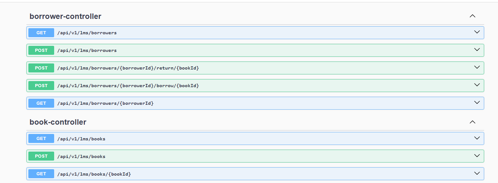

# Library Management System 

## Overview

## Features

- **Java 17**: Utilizes the latest Java version with Maven for dependencies.
- **Spring Boot**: Simplifies configuration and setup.
- **Dockerized**: Multi-stage Docker builds for optimized images.
- **API Documentation**: Interactive API documentation with Swagger.


### Environment

Ensure you have the following setup:
- Java 17
- Docker
- Maven
- GitHub account

### Build and Run Locally

1. **Clone the repository**:
    ```sh
    git clone https://github.com/giteggs/lms.git
    cd library-management-system
    ```

2. **Build the project using Maven**:
    ```sh
    mvn clean install
    ```

3. **Run the application**:
    ```sh
    java -jar target/library-management-system-0.0.1-SNAPSHOT.jar
    ```

### Docker

1. **Build Docker image**:
   docker-compose build: Builds the Docker images defined in the docker-compose.yml file.
   --no-cache: Instructs Docker to not use any cached layers when building the images.
    ```sh
    docker-compose build --no-cache
    ```

2. **Run Docker container**:
  docker-compose up -d starts the services defined in the docker-compose.yml file and runs them in the background.
    ```sh
    docker-compose up -d
    ```

### Documentation

Swagger UI is available at `http://localhost:8080/swagger-ui.html`.



### Kubernetes Manifests

The Kubernetes manifests are located in the `k8s` directory and include the following files:
- `mysql-secret.yaml`: Defines the Secrets for database credentials.
- `mysql-deployment.yaml`: Defines the Deployment for the MySQL database.
- `mysql-service.yaml`: Defines the Service to expose the MySQL database.
- `mysql-pvc.yaml`: Defines the PersistentVolumeClaim for MySQL data storage.
- `deployment.yaml`: Defines the Deployment for the application.
- `service.yaml`: Defines the Service to expose the application.
- `ingress.yaml`: (Optional) Defines the Ingress to route external traffic to the application.

### Apply Kubernetes Manifests

1. **Apply the manifests** to your Kubernetes cluster:
    ```sh
    kubectl apply -f k8s/mysql-secret.yaml
    kubectl apply -f k8s/mysql-pvc.yaml
    kubectl apply -f k8s/mysql-deployment.yaml
    kubectl apply -f k8s/mysql-service.yaml
    kubectl apply -f k8s/log-pv.yaml
    kubectl apply -f k8s/deployment.yaml
    kubectl apply -f k8s/service.yaml
    # Apply ingress only if you have set up an Ingress controller
    kubectl apply -f k8s/ingress.yaml
    ```

### Accessing the Application

- **LoadBalancer Service**: Once the Service is created, it will provision a LoadBalancer. You can get the external IP using:
    ```sh
    kubectl get svc library-management-system
    ```
- **Ingress (optional)**: If you have set up an Ingress controller, you can access the application using the host defined in the `ingress.yaml` file. Ensure you have configured the DNS or `/etc/hosts` file to resolve the hostname.

### Additional Commands

- **Scale the Deployment**:
    ```sh
    kubectl scale deployment/library-management-system --replicas=5
    ```
- **Check the status of the pods**:
    ```sh
    kubectl get pods -l app=library-management-system
    ```
- **Describe the Deployment**:
    ```sh
    kubectl describe deployment/library-management-system
    ```

### Cleanup

To delete the resources created, run:
```sh
kubectl delete -f k8s/mysql-secret.yaml
kubectl delete -f k8s/mysql-pvc.yaml
kubectl delete -f k8s/mysql-deployment.yaml
kubectl delete -f k8s/mysql-service.yaml
kubectl delete -f k8s/log-pv.yaml
kubectl delete -f k8s/deployment.yaml
kubectl delete -f k8s/service.yaml
# Delete ingress only if you applied it
kubectl delete -f k8s/ingress.yaml
```

### Viewing Logs

To view the logs, you can either:
- Check the console output when running the application.
- Open the log file located at `logs/library-management-system.log`.

**Running Tests:**

To run the unit tests, execute the following command in the root directory of your project:

```bash
mvn test
```
